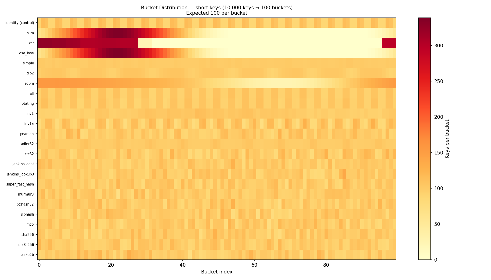
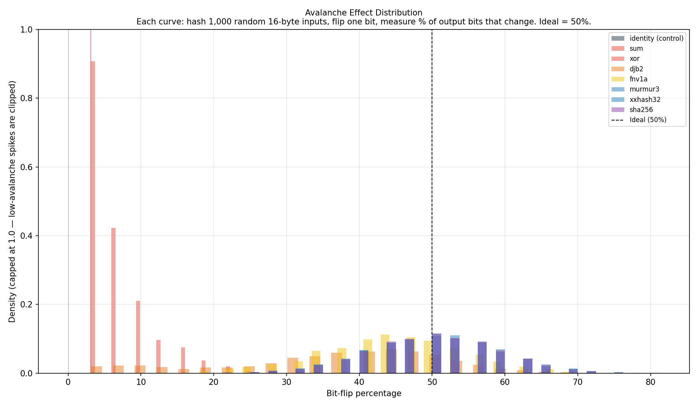
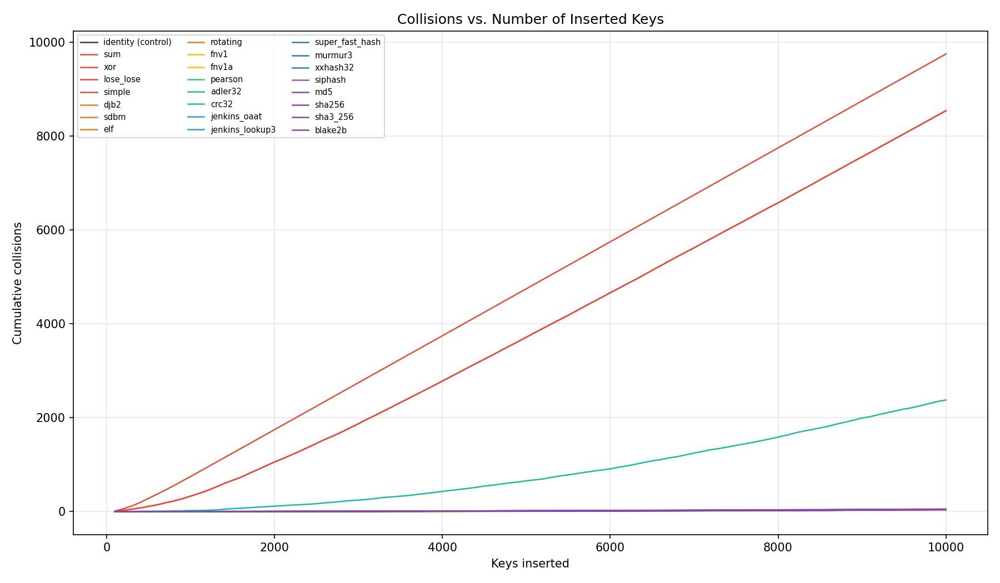

# HashCraft

A hands-on lab for learning hash functions. We have **23 hash functions** — 19 implemented from scratch in Python and 4 wrapping `hashlib` — from the worst possible (sum of bytes) to cryptographic gold standards (SHA-256). The goal is to run every function through the same battery of metrics, compare the results side-by-side, and understand *why* some hash functions are good and others are terrible.

## Background Reading

- [Hash Functions](docs/01_hash_functions.md) — what a hash function is, hash space, collisions, Pigeonhole Principle, avalanche effect, generic hash families (checksums, general-purpose, high-performance), MurmurHash deep dive, use cases

- [Cryptographic Hash Functions](docs/02_hash_cryptographic.md) — pre-image / collision resistance, MDCs (SHA-2, SHA-3, BLAKE3), MACs (HMAC, SipHash), password hashing

- [Hash Tables](docs/03_hash_table.md) — a data structure that *uses* hash functions: operations, load factor, chaining vs. open addressing, probing strategies, tombstones, resizing, Python `dict` internals

## Hash Functions Library

[`hash_functions/`](hash_functions/) — one algorithm per file, numbered from most naive to most sophisticated.

| File | Function | Category |
|------|----------|----------|
| `01_sum.py` | `sum` | naive |
| `02_xor.py` | `xor` | naive |
| `03_lose_lose.py` | `lose_lose` | naive |
| `04_simple.py` | `simple` | naive |
| `05_djb2.py` | `djb2` | classic |
| `06_sdbm.py` | `sdbm` | classic |
| `07_elf.py` | `elf` | classic |
| `08_rotating.py` | `rotating` | classic |
| `09_fnv1.py` | `fnv1` | fnv |
| `10_fnv1a.py` | `fnv1a` | fnv |
| `11_pearson.py` | `pearson` | pearson |
| `12_adler32.py` | `adler32` | checksum |
| `13_crc32.py` | `crc32` | checksum |
| `14_jenkins_oaat.py` | `jenkins_oaat` | jenkins |
| `15_jenkins_lookup3.py` | `jenkins_lookup3` | jenkins |
| `16_superfasthash.py` | `super_fast_hash` | modern |
| `17_murmur3.py` | `murmur3` | modern |
| `18_xxhash.py` | `xxhash32` | modern |
| `19_siphash.py` | `siphash` | keyed |
| `20_md5.py` | `md5` | crypto |
| `21_sha256.py` | `sha256` | crypto |
| `22_sha3.py` | `sha3_256` | crypto |
| `23_blake2.py` | `blake2b` | crypto |

Every function has the same signature — `fn(data: bytes, seed: int = 0) -> int`. A few functions use a different default seed (e.g. `djb2` defaults to 5381, `fnv1a` to the FNV offset basis).

Each function takes variable-length `bytes` and returns a **32-bit integer**. Five functions natively produce wider digests and are truncated to 32 bits so all hash functions can be compared on equal footing:

| Function   | Native Output | Truncated to |
|------------|--------------:|:------------:|
| `siphash`  | 64-bit        | 32-bit |
| `md5`      | 128-bit       | 32-bit |
| `sha256`   | 256-bit       | 32-bit |
| `sha3_256` | 256-bit       | 32-bit |
| `blake2b`  | 512-bit       | 32-bit |

You can look up a single function by name with `get_hash()`, or iterate over all with `get_all()`:

```python
from hash_functions import get_hash, get_all, get_category

fnv = get_hash("fnv1a")
print(fnv(b"hello"))

for name, fn in get_all():
    print(f"{name:20s} -> {fn(b'test'):08x}")
```

## Metrics

We evaluate every hash function on five metrics.

### 1. Throughput

**Question:** *Is this hash function fast on large data?*

**What:** Bytes processed per second (reported as MB/s).

**How:** Feed a large buffer to the hash function repeatedly. Divide total bytes hashed by elapsed time.

**Why it matters:** In data pipelines, compression (LZ4 + xxHash), and deduplication, the hash function runs on every byte of data. A slow hash becomes the bottleneck.

### 2. Latency

**Question:** *Is this hash function fast on short keys?*

**What:** Time per hash call (reported as ns or µs).

**How:** Hash many short keys in a loop. Divide total time by number of calls.

**Why it matters:** Hash tables call the hash function on every `lookup`, `insert`, and `delete`. Keys are often short (usernames, IDs, URLs), so the fixed per-call overhead (function call, seed setup, finalization) dominates over per-byte processing. This makes per-call latency more relevant than bulk throughput for hash table workloads.

### 3. Distribution

**Question:** *Does this hash function spread keys evenly?*

**What:** A single number measuring how far the actual bucket counts deviate from a perfectly uniform distribution.

**How:** Hash N keys into B buckets (using `hash(key) % B`), count how many keys land in each bucket, and compute the chi-squared statistic — a single number that measures how far the observed counts deviate from a perfectly even split. The benchmark then converts χ² into a **|z| score** (how many standard deviations from ideal). For the full explanation see [Chi-Squared Test](docs/04_chi_squared_test.md).

**Why it matters:** Poor distribution causes some buckets to overflow (long chains) while others sit empty. This turns O(1) hash table lookups into O(n) linear scans.

### 4. Avalanche Effect

**Question:** *Does this hash function react to small input changes?*

**What:** Average percentage of output bits that flip when a single input bit changes. The ideal is 50% — each output bit has an independent 50/50 chance of flipping, meaning the hash function treats every input bit as equally important.

**How:** For many random inputs: hash the original, flip one random bit, hash again, XOR the two outputs, count differing bits.

**Why it matters:** Weak avalanche means similar inputs produce similar hashes. In a hash table, keys like `"user_001"`, `"user_002"`, `"user_003"` would all land in nearby buckets, causing clustering. Strong avalanche ensures they scatter uniformly.

### 5. Collision Rate

**Question:** *How often do different inputs produce the same hash?*

**What:** Number of keys that land in an already-occupied bucket when N keys are hashed into B buckets.

**How:** Hash N random keys and assign each to a bucket. When a key maps to a bucket that already contains another key, that is a collision. Count total collisions.

**Why it matters:** Every collision degrades performance. With [chaining](docs/03_hash_table.md#open-hashing-chaining), each collision adds one link to a chain. With [open addressing](docs/03_hash_table.md#closed-hashing-open-addressing), each collision triggers a probe sequence.

## Test Inputs

We cannot feed every possible input into each hash function — the input space is infinite. Instead, we use two well-established techniques from hash function research — **statistical sampling** and **adversarial input classes** — inspired by [SMHasher](https://github.com/aappleby/smhasher), the industry-standard hash function test suite created by Austin Appleby (the author of MurmurHash). Our benchmark implements a subset of its tests in Python.

### Statistical Sampling

A large enough random sample produces statistically significant results without exhaustive testing. With sufficient samples, statistics like mean avalanche and collision rate closely approximate their true values (law of large numbers), and the **Central Limit Theorem** ensures the sampling distribution is approximately normal — which lets us compute meaningful confidence intervals.

- **10,000+ random inputs** is sufficient for avalanche and collision measurements — the confidence interval at this size is narrow enough to distinguish good hashes from bad ones.
- **Chi-squared test** gives a formal answer: "are these bucket counts consistent with a uniform distribution?" It produces a statistic and a p-value, not a guess.

### Adversarial Input Classes

Random inputs test the average case. But a hash function that looks good on random data can fall apart on structured data. We test specific input patterns that are known to expose weaknesses:

| Input Class | What It Exposes | Example |
|-------------|----------------|---------|
| **Random uniform** | Baseline behavior | `os.urandom(16)` × 100K |
| **Sequential integers** | Poor bit mixing — low bits dominate | `0, 1, 2, 3, …, 99999` |
| **Similar strings** | Weak avalanche — nearby inputs cluster | `"key_0001"` … `"key_9999"` |
| **Repeated prefixes** | Failure to process all bytes | `"prefix_a"`, `"prefix_b"`, … |
| **Short keys** | Insufficient entropy for finalization | `"a"`, `"b"`, … `"zz"` |

A good hash function performs well on **all** input classes. A bad one performs well on random data but collapses on patterned data — and the benchmarks will show this.

## The `identity` Control

Every table and plot includes a control row named `identity`, which is **not a hash function at all**. It reinterprets the first four bytes of the key as an integer and returns them unmixed:

```python
def identity(data: bytes, seed: int = 0) -> int:
    return int.from_bytes(data[:4].ljust(4, b"\0"), "little")
```

It exists to calibrate the benchmark. **Any metric on which `identity` scores as well as a real hash function is a metric that cannot distinguish hashing from doing nothing.** This turns out to be a critical insight: on random keys, `identity` looks competitive with the best hashes because uniformly random keys are *already* uniformly distributed — there is no structure for a hash function to remove. The random-key column becomes a sanity check, not a ranking:

| Sample size | `identity` (no hashing) | `crc32` | `murmur3` | `sha256` |
|---|---|---|---|---|
| 10,000 keys | 98 | 93 | 100 | 103 |
| 100,000 keys | 108 | 102 | 92 | 91 |
| 500,000 keys | 99 | 80 | 120 | 87 |

Doing nothing scores as well as SHA-256. But switch to structured input and the control collapses: on the `similar` workload (`key_0001`, `key_0002`, …), `identity` produces 4,999 collisions out of 5,000 keys and |z| ≈ 39,800, while `murmur3` stays at 43 collisions and |z| = 0.8. **Structured input is where the differences live**, which is why the per-workload tables carry all the weight.

## Benchmark

[`benchmark.py`](benchmark.py) runs all hash functions from [`hash_functions/`](hash_functions/) through the five metrics described above and produces a side-by-side comparison.

### How to run

```bash
python3 benchmark.py              # full benchmark (all hash functions, larger sample sizes)
python3 benchmark.py --quick      # reduced samples for a faster run (~14 s)
python3 benchmark.py --no-plots   # scorecard only, skip plot generation
python3 benchmark.py --plot-dir results   # save plots to results/ instead of plots/
```

### How it works

1. **Generate workloads** — creates random byte strings up front. Every hash function receives the same keys, ensuring a fair comparison.
2. **Measure each function** — iterates over the registry, preceded by the `identity` control, and runs all five metrics. Progress is printed as each metric completes (`T` throughput, `L` latency, `D` distribution, `A` avalanche, `C` collisions).
3. **Print scorecard** — a formatted table with one row per hash function and one column per metric, plus the expected χ² for a uniform distribution as a reference.
4. **Per-workload analysis** — generates five input classes (random, sequential integers, similar strings, repeated prefixes, short keys) and measures χ² at both bucket counts, the two-sided deviation |z|, and the collision rate for each hash function on every input class. Prints four comparison tables showing which hashes degrade on which workloads.
5. **Generate plots** — if matplotlib is installed, saves four PNG files to the `plots/` directory (or the path given by `--plot-dir`).

### Configuration

The script has two built-in parameter sets — **full** (default) and **quick** (`--quick`). Key parameters:

| Parameter                | Full           | Quick          | Purpose |
|--------------------------|---------------:|---------------:|---------|
| Throughput buffer        | 1 MB × 3       | 256 KB × 2     | Data size for MB/s measurement |
| Latency iterations       | 10,000         | 2,000          | Calls per function for ns/call timing |
| χ² keys → buckets        | 50,000 → 100 & 128 | 10,000 → 100 & 128 | Sample size for distribution test; both a non-power-of-two and a power-of-two modulus |
| Avalanche samples        | 5,000 | 1,000  | Random inputs for bit-flip measurement |
| Collision keys → buckets | 10,000 → ~1 M  | 5,000 → ~262 K | Insertions for collision counting |


## Analysis

After running the benchmark, the scorecard and plots reveal clear patterns. This section walks through each metric and explains the results.

### Throughput and Latency

These two metrics measure speed — throughput on large data, latency on short keys.

```
  Hash Function         Category      Throughput     Latency
  ──────────────────────────────────────────────────────────
  identity (control)    control      1200.0 GB/s      240 ns
  sum                   naive          13.5 MB/s      1.0 µs
  xor                   naive          18.8 MB/s      827 ns
  lose_lose             naive          13.3 MB/s      1.1 µs
  simple                naive           9.4 MB/s      1.5 µs
  djb2                  classic         8.4 MB/s      1.6 µs
  sdbm                  classic         4.8 MB/s      3.8 µs
  elf                   classic         3.1 MB/s      4.2 µs
  rotating              classic         5.1 MB/s      2.6 µs
  fnv1                  fnv             7.7 MB/s      1.9 µs
  fnv1a                 fnv             7.2 MB/s      1.8 µs
  pearson               pearson         3.1 MB/s      9.2 µs
  adler32               checksum        9.3 MB/s      3.9 µs
  crc32                 checksum        5.2 MB/s      2.8 µs
  jenkins_oaat          jenkins         3.7 MB/s      3.8 µs
  jenkins_lookup3       jenkins         3.7 MB/s      4.3 µs
  super_fast_hash       modern          4.8 MB/s      3.7 µs
  murmur3               modern          3.4 MB/s      6.7 µs
  xxhash32              modern          5.2 MB/s      3.9 µs
  siphash               keyed           2.2 MB/s     17.2 µs
  md5                   crypto        761.9 MB/s      808 ns
  sha256                crypto        459.6 MB/s      915 ns
  sha3_256              crypto        370.1 MB/s      1.2 µs
  blake2b               crypto        675.0 MB/s      679 ns
```

The `identity` control at 1,200 GB/s is a reminder of what this metric rewards: it is the fastest row in the table by orders of magnitude and it does not hash anything.

After `identity`, the crypto hashes (`md5`, `sha256`, `sha3_256`, `blake2b`) appear fastest among the real hash functions — but this is a measurement artifact. They delegate to C via `hashlib`, while the other 19 functions run in pure Python. In a fair all-C comparison the ranking reverses: xxHash benchmarks show `xxhash32` at 9.7 GB/s and `murmur3` at 3.9 GB/s, while `md5` manages 0.6 GB/s and `sha256` 0.8 GB/s — crypto hashes are 5–16× *slower* due to extra rounds of computation (SHA-256 does 64 rounds per block).

Among the pure-Python implementations, naive hashes (`sum`, `xor`) are fastest because they do the least work per byte — a single addition or XOR. Modern hashes (`murmur3`, `xxhash32`) are slower because each byte triggers multiple operations (multiply, shift, rotate, XOR). This is the fundamental speed-vs-quality tradeoff: more mixing produces better distribution and avalanche, but costs more time.

### Distribution

The following heatmap shows how each hash function distributes **5,000 short keys** across **100 buckets**. Each key is hashed and assigned to a bucket via `hash(key) % 100`. Each row is one hash function; each column is one bucket; colour intensity indicates how many keys landed there (darker = more keys). With 5,000 keys and 100 buckets, a perfectly uniform distribution would put exactly 50 keys in every bucket.



Short keys are structured input — they use a narrow range of ASCII byte values and share common prefixes. A hash function must actively mix these patterns to produce a uniform distribution. The heatmap reveals which ones succeed and which ones fail:

- **`sum`, `xor`, `lose_lose`** pile keys into the first ~30 buckets. The rest sit nearly empty. These hashes do too little mixing — they add or XOR small byte values, so the outputs stay small.

- **`sdbm`** shows strong banding at both edges of the bucket range, with a gap in the middle.

- **`identity`** clusters in the low buckets because it reads the first 4 bytes as an integer, and short ASCII strings produce small values.

- **Every hash from `jenkins_oaat` downward** distributes keys evenly — uniform mottling with no visible pattern. That is the difference between a hash function that mixes well and one that does not.

The following plot quantifies distribution quality with the χ² statistic across **all five input classes** at once:


Each cell is one hash function on one input class. **Colour is |z|** — the two-sided deviation of χ² from its expected value, so green means "on target" and red means "off target in either direction". The cell text is the raw χ². The left block uses 100 buckets, the right block 128 (power of two, exposing low-bit quality).

- **Consistently good** — `jenkins_oaat`, `jenkins_lookup3`, `super_fast_hash`, `murmur3`, `xxhash32`, `siphash`, and all four crypto hashes hold |z| ≤ 3 across all ten columns. This requires **multiple mixing operations per byte** (multiply, shift, rotate, XOR in combination) and a **finalization step** that scrambles any remaining patterns so the last bytes influence all output bits.

- **Too-low χ² is a failure, not a win.** On sequential keys `simple` scores χ² ≈ 0 and `djb2` scores 6 against an ideal of 99. These look like the best results in the table but are degenerate: the hash is mapping consecutive keys onto consecutive buckets — counting, not mixing. The |z| score correctly flags these as failures (|z| ≈ 7–8).

- **CRC32** looks flawless on random data (χ² = 99, |z| = 0.0) but hits |z| ≈ 8 on sequential keys at 128 buckets — the power-of-two modulus exposes a predictable pattern. CRC32 is also linear over GF(2), meaning any input bit change produces a predictable change in the output, so an attacker can craft collisions at will. This makes CRC32 unsuitable for hash tables facing untrusted input.

- **Adler-32** is essentially two running sums and collapses on similar strings (χ² ≈ 5×10⁴ at 128 buckets).

- **`elf` and `rotating`** score perfectly on random data but hit χ² ≈ 3×10⁴ on sequential and prefix inputs. The failures grow even worse at 128 buckets.

#### Why Test at Two Bucket Counts?

The number of buckets affects what the chi-squared test can detect. Testing at a single bucket count can miss weaknesses that only appear at a different size. A thorough test runs at two sizes — one that is a power of two and one that is not:

- **Non-power-of-two (e.g., 100 buckets)** — the modulus operation (`hash % 100`) mixes information from many bits of the hash value. This tests general distribution quality.

- **Power of two (e.g., 128 buckets)** — the modulus operation (`hash % 128`) is equivalent to masking off the bottom 7 bits (`hash & 0x7F`), so only the lowest 7 bits of the hash determine the bucket. This tests **low-bit quality** specifically. A hash function with weak low-bit mixing will pass the 100-bucket test but fail the 128-bucket test.

Power-of-two table sizes are extremely common in real-world hash tables because they allow the modulus to be replaced with a fast bitwise AND. A hash function that only looks good at non-power-of-two sizes is hiding a weakness that will surface in practice.

For example:

- **CRC32** scores a near-perfect |z| on random data at 100 buckets, but hits |z| ≈ 8 on sequential keys at 128 buckets. CRC32's polynomial division produces a one-to-one mapping on 4-byte inputs — it permutes sequential integers without collisions, but with a predictable pattern when reduced modulo a power of two.

- **`elf` and `rotating`** look fine on random data at 100 buckets, but on sequential keys their χ² explodes — and grows far worse at 128 buckets than at 100. The power-of-two modulus exposes how little their low bits vary.

Testing at both bucket counts catches these weaknesses.


### Avalanche Effect

The **avalanche effect** measures how well a hash function mixes its input: flip a single bit in the input, and ideally ~50% of the output bits should change. A perfect avalanche means every input bit has an equal chance of affecting every output bit.

**How the test works.** For each hash function, we:

1. Generate **1,000 random 16-byte inputs** (`os.urandom(16)`).
2. Hash the original input → `h1`.
3. Flip **one random bit** in the input.
4. Hash the modified input → `h2`.
5. Count the number of bits that differ between `h1` and `h2` (out of 32 output bits), and express it as a percentage.

The histogram below shows the distribution of those 1,000 bit-flip percentages for eight representative hash functions. The dashed line at 50% marks the ideal.



> **Why the Y-axis is capped at 1.0.** `identity` (0.8%) and `xor` (3.1%) produce
> extremely narrow spikes at the far left — their density peaks reach 12–50.
> Without capping, these spikes crush the Y-axis scale and make everything else
> invisible. With the cap, the clipped spikes are still visible as tall bars at the
> left edge, while the good hashes near 50% become readable.

Avalanche is the clearest single indicator of hash quality. All hash functions fall into distinct tiers:

- **Near-zero avalanche (3–7%)** — `sum`, `xor`, `elf`, and `rotating` don't mix bits broadly. Changing one input byte only affects a few output bits. `xor` folds all bytes into a single byte (3.1%). `elf` shifts left by 4 and adds — too weak to cascade.

- **Weak avalanche (36–38%)** — `simple` (h × 31 + byte), `djb2` (h × 33 + byte), and `sdbm` (h × 65599 + byte) each use a single multiply per byte. The multiply helps but is not enough on its own to reach 50%.

- **FNV-1a vs FNV-1 (42–45%)** — FNV-1 multiplies then XORs, so the XOR only affects the lowest byte and the multiply in the *next* iteration must propagate it upward. FNV-1a reverses the order: XOR then multiply, so the multiply immediately cascades the change across all bits. One-line difference, measurably better avalanche (~45% vs ~42%).

- **Near-perfect avalanche (49–50%)** — `murmur3`, `xxhash32`, `jenkins_oaat`, `crc32`, `pearson`, and all crypto hashes achieve near-perfect 50%. This requires either multiple mixing operations per byte with a finalization step, or a mathematically strong construction (CRC32's polynomial division, Pearson's permutation table). Pearson's table has to be a genuine permutation of 0–255 for this to hold — a table with duplicate or missing entries destroys uniformity in the low output byte, which is exactly the byte a `hash % bucket_count` table depends on, so [`11_pearson.py`](hash_functions/11_pearson.py) asserts the property at import time.

### Collision Rate

A **collision** happens when two different keys hash to the same bucket. In a hash table, collisions force extra work (chaining, probing), so fewer collisions = better performance. We generate **10,000 random 16-byte keys** and insert them one at a time into a simulated hash table with **~1 million buckets** (2²⁰). For each key:

1. Compute `hash(key) % 1,048,576` to get a bucket index.
2. If that bucket has already been used by a previous key, count it as a collision.
3. Otherwise, mark the bucket as occupied.

The plot below tracks cumulative collisions (Y-axis) as keys are inserted (X-axis). Each line is one hash function.



**Reading the plot:**

- **Steep curves (top):** `xor`, `sum`, `lose_lose`, and `rotating` collide on nearly every insert. `xor` hits ~9,700 collisions out of 10,000 keys because XORing 16 bytes produces only 256 possible values (8-bit effective output) — with 1 million buckets, it can only ever use 256 of them, so after 256 keys *every* new key collides.

- **Flat lines (bottom):** `murmur3`, `xxhash32`, `siphash`, and all crypto hashes produce only ~40–50 collisions out of 10,000 keys. With 1 million buckets and 10,000 keys the table is only 1% full, so a truly random function would produce very few collisions. These hashes track that theoretical minimum closely.

- **`identity` on random keys** produces collisions in the same range as `murmur3` — for the same reason described in [The `identity` Control](#the-identity-control): random keys are already spread across the bucket space, so even a do-nothing hash distributes them well. The per-workload collision table is where the differences appear.

- **The curve steepens as keys accumulate** because the probability of hitting an occupied bucket grows with the load factor (keys stored ÷ buckets available). This is the [birthday paradox](docs/03_birthday_paradox.md) in action. Good hashes follow the theoretical birthday curve; bad ones diverge immediately because they compress outputs into a tiny fraction of the bucket space.

### When to use which hash?

| Use Case                         | Best Choice                    | Why                                |
|----------------------------------|--------------------------------|------------------------------------|
| Hash table (general)             | `murmur3`, `xxhash32`          | Fast + excellent distribution |
| Hash table (adversarial input)   | `siphash`                      | Keyed — prevents HashDoS (Python, Rust, Ruby default) |
| Hash table (embedded / minimal)  | `fnv1a`                        | 3 lines of code, no tables, good distribution; MSVC `std::hash` default |
| Hash table (kernel / networking) | `jenkins_lookup3`              | Linux kernel `jhash`; processes 12 bytes/round, fast on short keys |
| Bloom filter                     | `murmur3` with different seeds | Fast + uniform per seed |
| Data deduplication               | `xxhash32`, `blake2b`          | Fast for chunking, secure for verification |
| Error detection                  | `crc32`                        | Catches burst errors, hardware-accelerated (SSE 4.2, ARM CRC) |
| Stream/compression checksum      | `adler32`                      | Used inside zlib/gzip/PNG DEFLATE; faster than CRC32 in software but weaker error detection |
| Non-security checksums (legacy)  | `md5`                          | Ubiquitous (`md5sum`), fast; **broken** for cryptographic use since 2004 |
| File integrity                   | `sha256`, `blake2b`            | Collision resistance, standardized |
| Post-quantum readiness           | `sha3_256`                     | NIST SHA-3 standard (Keccak); backup if SHA-2 is ever broken |
| Password storage                 | `bcrypt`, `Argon2`             | Deliberately slow (not in this library) |
