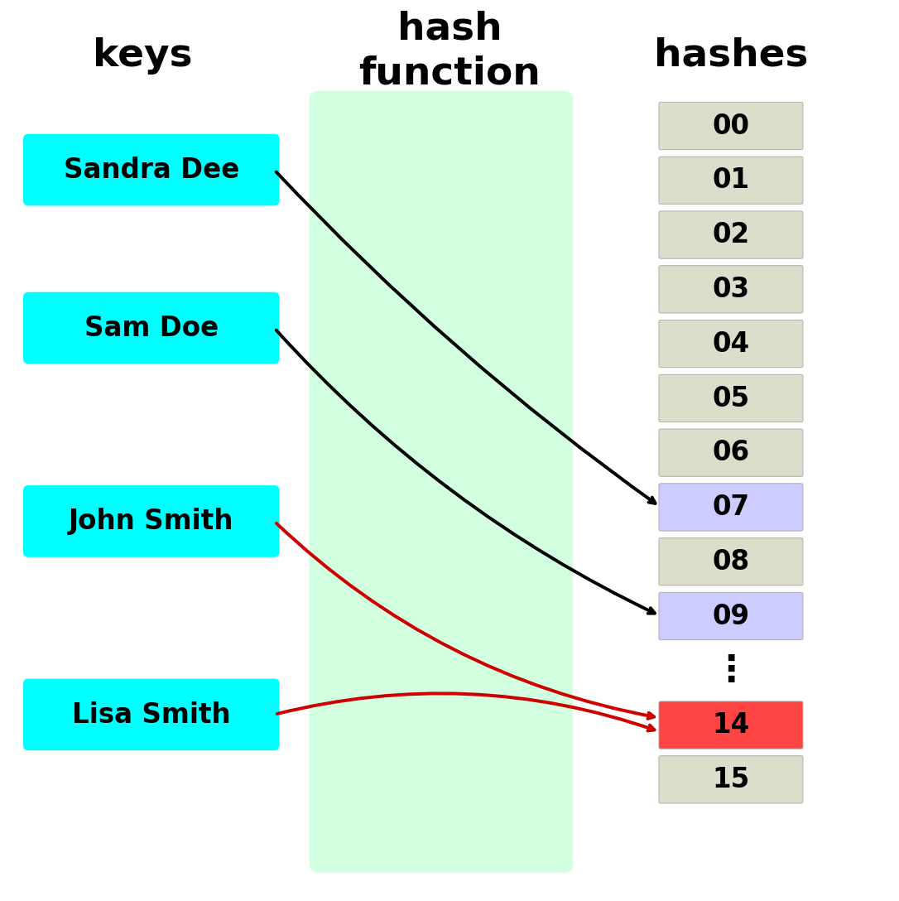
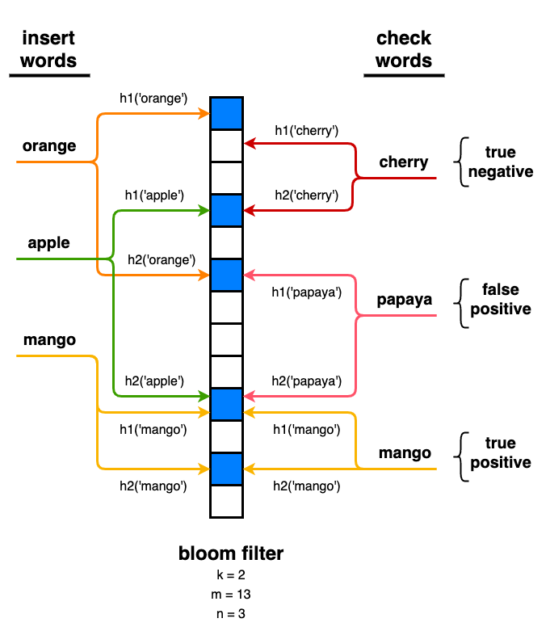
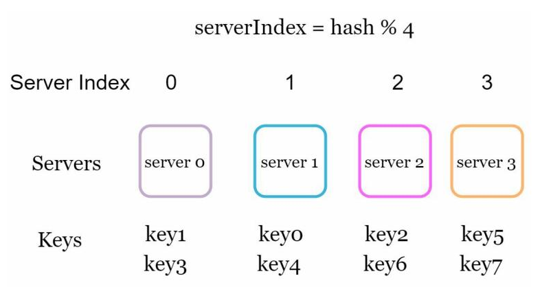
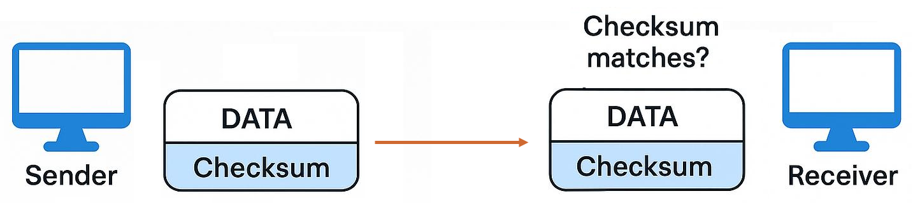
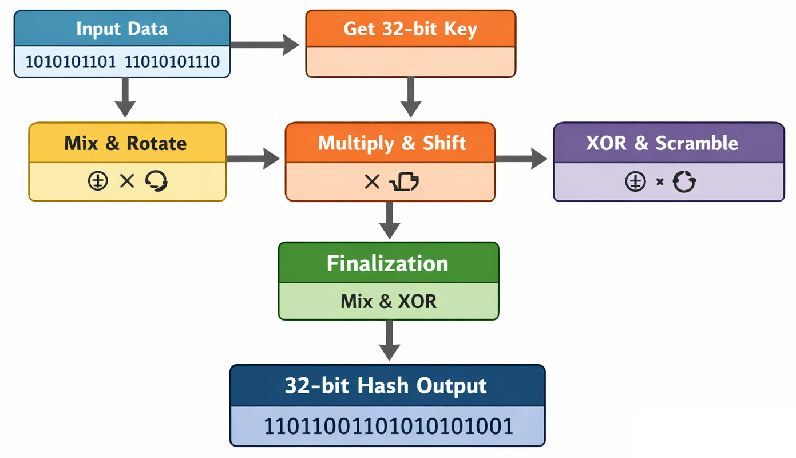

# Hash Function

A hash function `H` takes an input `M` of variable length and produces a fixed-length output `h = H(M)`. This output is referred to as a **hash value**, **hash code**, **digest**, or simply a **hash**.

The **hash space** is the range of all possible outputs of the hash function. For a hash function producing n-bit outputs, the size of the hash space is `2ⁿ`. For example, a 256-bit hash function can produce up to `2²⁵⁶` distinct values.

## A Simple Example

Below is a toy hash function in Python that maps any string to an integer in the range `[0, 255]` (an 8-bit hash space):

```python
def simple_hash(s, size=256):
    h = 0
    for ch in s:
        h = (h * 31 + ord(ch)) % size
    return h

print(simple_hash("hello"))   # 210
print(simple_hash("world"))   # 146
```

How it works:

1. Start with `h = 0`.
2. For each character, convert it to its ASCII code with `ord(ch)`.
3. Combine it into the running hash: multiply the current hash by 31, add the character code, then take the result modulo `size`.

The modulo operation keeps the output within a fixed range — here `[0..255]`, which is an 8-bit hash space with only 256 possible values.

## Characteristics of Hash Functions

Hash functions are foundational in computer science and information security. Their effectiveness is measured by the following properties:

- **Determinism**

    A hash function must always return the same output for the same input. This ensures consistency in use cases such as hash tables, where the hash determines the storage location of data.

- **Fast Computation**

    A practical hash function should be computationally efficient. Computing `H(x)` must be quick, making it suitable for large-scale or real-time applications such as in-memory databases, caching systems, and gaming engines.

- **Uniform Distribution**

    A good hash function spreads outputs evenly across the hash space. This reduces the chance of **collisions** (different inputs producing the same output) and ensures balanced distribution in data structures like hash tables, leading to efficient storage and retrieval.

- **Avalanche Effect**

    A small change in the input — even flipping a single bit — should produce a drastically different output. Ideally, roughly half the output bits change unpredictably. This prevents similar inputs (like `"hello1"` and `"hello2"`) from clustering into nearby hash values, which would cause uneven distribution.

## Hash Collision

A hash collision occurs when two different inputs produce the same hash value.

Collisions are unavoidable due to the **Pigeonhole Principle**: if you have more items than containers, at least two items must share a container. Because the set of possible inputs is usually much larger than the set of possible outputs, some inputs must map to the same hash value.

Consider `simple_hash` from the example above with a hash space of only 16 values (`size=16`). As the diagram below shows, `"John Smith"` and `"Lisa Smith"` both produce a hash value of 14 — a collision — while `"Sandra Dee"` maps to 7 and `"Sam Doe"` maps to 9.



With such a small hash space, collisions like this are very likely. Even with larger hash spaces, collisions are inevitable — a well-designed hash function does not eliminate them but minimizes them by distributing outputs uniformly.

## Generic Hash Functions

Generic (non-cryptographic) hash functions prioritize **speed** and **uniform distribution** rather than security. They are used wherever fast lookups, partitioning, or error detection are needed and there is no adversary trying to forge or reverse the hash. They fall into three categories based on what they are designed for:

### Checksums (Error Detection)

Checksums detect accidental data corruption during transmission or storage. They are optimized for catching bit errors, not for distributing keys evenly. Some (like Adler-32) cause clustering in hash tables; others (like CRC32) happen to distribute well due to polynomial mixing, but CRC's linearity over GF(2) makes it vulnerable to adversarial collision attacks, so it is still unsuitable for hash tables facing untrusted input.

| **Hash Function** | **Year** | **Designer / Origin** | **Bit Length** | **Key Characteristics / Use Cases** |
|---|---|---|---|---|
| **CRC32 / CRC64** | 1970s | IBM | 32 / 64-bit | Polynomial-based; excellent at catching burst errors. Used in Ethernet, TCP, ZIP, PNG. |
| **Adler-32** | 1995 | Mark Adler | 32-bit | Simpler and faster than CRC but catches fewer error patterns. Used in zlib. |

### General-Purpose Hash Functions

The classic, portable hashes designed specifically for hash tables and data structures. They provide good distribution and avalanche properties without requiring special CPU instructions — they run well everywhere.

| **Hash Function** | **Year** | **Designer / Origin** | **Bit Length** | **Key Characteristics / Use Cases** |
|---|---|---|---|---|
| **FNV (FNV-1 / FNV-1a)** | 1991 | Glenn Fowler, Landon Curt Noll | 32 / 64 / 128-bit | Extremely simple (one XOR + one multiply per byte); good for small keys; common in hash tables and compilers. |
| **MurmurHash** | 2008 | Austin Appleby | 32 / 64 / 128-bit | Much better distribution than FNV; ideal for hash tables, Bloom filters, and distributed key partitioning. See [MurmurHash deep dive](#murmurhash) below. |

### High-Performance / Hardware-Optimized Hash Functions

Designed to maximize throughput on modern CPUs by exploiting hardware acceleration features — such as SIMD instructions (which process multiple data elements in a single operation) and AES-NI (dedicated circuitry for encryption-related math). Choose these when raw hashing speed is critical — such as data compression pipelines, large-scale deduplication, or high-throughput networking.

| **Hash Function** | **Year** | **Designer / Origin** | **Bit Length** | **Key Characteristics / Use Cases** |
|---|---|---|---|---|
| **CityHash** | 2011 | Google | 64 / 128 / 256-bit | Optimized for short strings; used in Google infrastructure; inspired by MurmurHash. |
| **SpookyHash** | 2011 | Bob Jenkins | 128-bit | Optimized for large keys (128+ bytes); strong avalanche effect and good mixing quality. |
| **xxHash** | 2012 | Yann Collet | 32 / 64 / 128-bit | Most portable of the fast hashes; excellent for checksums, hash tables, and data compression. |
| **FarmHash** | 2014 | Google | Variable | Successor to CityHash; more portable across CPU generations. |
| **MetroHash** | 2016 | J. Andrew Rogers | 64 / 128-bit | Requires SIMD support; great for hash maps and data indexing at scale. |
| **MeowHash** | 2018 | Jeff Preshing | 128-bit | Uses AES-NI hardware; extremely fast for large data blocks and high-throughput workloads. |

## Use Cases of Generic Hash Functions

### Hash Tables and Key-Based Lookups

A hash table maps keys to values using a hash function to compute each key's storage index. This gives **O(1)** average-time lookups, inserts, and deletes — far faster than scanning a list or searching a tree for most workloads.

**Commonly used hashes:** MurmurHash, xxHash, FNV-1a

- **Language built-ins** — Python `dict`, C++ `unordered_map`, Java `HashMap`, and Go `map` all use hash tables internally. Every time you write `my_dict["key"]`, a hash function runs behind the scenes.

- **Compiler symbol tables** — Compilers and interpreters store variable names, function names, and type information in hash tables so they can resolve identifiers in constant time during parsing and code generation.

- **Database indexing** — Databases create hash-based indexes for columns that are frequently queried with exact-match lookups (e.g., `WHERE user_id = 42`). The hash index maps the column value directly to the row's storage location, making retrieval faster than a B-tree scan for equality queries.

- **File system metadata** — File systems like NTFS and EXT use hash tables to quickly map file names or inode numbers to their on-disk locations, avoiding slow directory scans.

- **Caching and memoization** — Caches (like Memcached or Redis) use hash tables to store previously computed results. When the same input appears again, the system returns the cached result instead of recomputing it. Memoization in application code works the same way — `functools.lru_cache` in Python is backed by a dictionary.

> Hash tables are the most common use case for generic hash functions. Many of the other use cases described below are built on top of hash tables. For a detailed explanation — including collision resolution, load factor, and implementations — see [Hash Table](03_hash_table.md).

### Bloom Filters and Probabilistic Data Structures

A Bloom filter is a compact data structure that answers one question: *"Is this element in the set?"* It consists of a **bit array** (all zeros initially) and **k hash functions**. Each hash function maps an element to a position in the array.

- **Inserting** an element: compute all k hashes and set those bit positions to 1.

- **Checking** an element: compute all k hashes and look at those bit positions. If **any** bit is 0, the element is definitely not in the set. If **all** bits are 1, the element is *possibly* in the set — but those bits may have been set by other elements.

The diagram below illustrates this with k = 2 hash functions (`h1`, `h2`) and a 13-bit array. Three fruits — `"orange"`, `"apple"`, and `"mango"` — are inserted on the left. Then three lookups are performed on the right:



| Lookup | What happens | Result |
|---|---|---|
| `"cherry"` | `h2('cherry')` lands on a 0-bit | **True negative** — definitely not in the set |
| `"papaya"` | Both `h1` and `h2` land on 1-bits that were set by *other* elements (orange, apple) | **False positive** — the filter says "possibly yes", but papaya was never inserted |
| `"mango"` | Both `h1` and `h2` land on the same 1-bits set during its own insertion | **True positive** — correctly identified as present |

The key trade-off: if the filter says *no*, you can trust it completely. If it says *yes*, there is a small chance it is wrong (a false positive), so you must verify against the actual data source. This makes Bloom filters ideal as a **fast pre-check** — they cheaply eliminate the majority of unnecessary lookups before hitting a slower source like disk or network.

**Commonly used hashes:** MurmurHash3, xxHash, CityHash

### Load Balancing and Data Partitioning

In distributed systems, hash functions decide **which server handles which request**. The simplest approach is `hash(key) % number_of_servers`, which distributes keys roughly evenly.

The diagram below shows 4 servers and 8 keys. Each key is hashed and the result is divided by 4 — the remainder (`hash % 4`) determines which server stores that key. For example, if `hash(key0) = 9`, then `9 % 4 = 1`, so `key0` goes to server 1. The same formula sends `key1` and `key3` to server 0, `key2` and `key6` to server 2, and so on — spreading the data evenly without any central coordinator deciding the assignments.



A limitation of this simple approach is that adding or removing a server changes the divisor, which **reshuffles most keys** to different servers. More advanced systems solve this with **consistent hashing**, where servers are placed on a ring of hash values so that adding or removing a server only moves a small fraction of keys. This is how systems like Cassandra, DynamoDB, Kafka, and Memcached distribute data at scale.

**Commonly used hashes:** MurmurHash, xxHash

### Data Integrity and Error Detection

Checksums are short hash values appended to data so the receiver can verify it was not corrupted during transmission or storage. If the data changes — even by a single bit — the checksum will not match, and the receiver knows to request a retransmission or flag the error.



**Commonly used hashes:** CRC32, CRC64, Adler-32

### File and Data Deduplication

Deduplication systems split data into chunks, hash each chunk, and compare hashes to find duplicates. If two chunks produce the same hash, they are (almost certainly) identical, and only one copy needs to be stored. This can dramatically reduce storage costs for backups, container registries, and cloud storage.

Tools like restic, Borg, and ZFS deduplication use this approach.

**Commonly used hashes:** xxHash, CityHash, FarmHash

## MurmurHash

MurmurHash is a non-cryptographic hash function designed by Austin Appleby in 2008. It is optimized for speed and uniform distribution, making it ideal for hash tables, data partitioning, and consistent hashing — use cases where performance and even distribution matter more than cryptographic security.

Unlike cryptographic hash functions (e.g., SHA-256 or MD5), MurmurHash does not aim to resist intentional collisions or guarantee one-way security properties. Instead, it focuses on producing well-distributed hash values quickly, even for similar or patterned input data.

This makes MurmurHash especially valuable in systems like **Cassandra**, **Memcached**, and **Kafka**, where balanced data distribution directly impacts scalability and performance.

### Versions

Over time, several versions have been developed, each improving on performance, portability, or distribution quality:

| **Version**     | **Description**                                                                                                                       | **Typical Use**                         |
| --------------- | ------------------------------------------------------------------------------------------------------------------------------------- | --------------------------------------- |
| **MurmurHash1** | The original version (2008); basic 32-bit hash with good distribution but limited portability.                                        | Historical use only                     |
| **MurmurHash2** | Improved 32-bit and 64-bit variants; widely used in early systems but had endianness and alignment issues.                             | Legacy systems                          |
| **MurmurHash3** | The modern and most stable variant, supporting both 32-bit and 128-bit outputs; endianness-safe and with strong avalanche properties. | Cassandra, Redis Cluster, Elasticsearch |

The output bit width (32, 64, or 128 bits) determines the size of the hash space and the collision resistance. Modern distributed systems like Cassandra and Elasticsearch rely on MurmurHash3 128-bit due to its consistency, portability, and excellent statistical distribution.

### How It Works

The diagram below shows the MurmurHash3 (32-bit) pipeline. The input data flows through a series of stages, each designed to scramble the bits more thoroughly than the last:



1. **Get 32-bit Key** — The input is split into 32-bit (4-byte) chunks. If the input is shorter than 4 bytes, it is padded.

2. **Mix & Rotate** — Each chunk is combined with the running hash using XOR (`⊕`), multiplied by a large constant, and then **rotated** (bits are shifted sideways and wrapped around). This ensures every input bit starts influencing the entire hash.

3. **Multiply & Shift** — The result is multiplied again and **bit-shifted** (bits moved left or right, with the overflow discarded). This spreads the influence of each bit across different positions.

4. **XOR & Scramble** — Another round of XOR, multiplication, and rotation further mixes the bits. By this point, changing a single input bit affects many output bits.

5. **Finalization** — After all chunks are processed, a final mix-and-XOR pass eliminates any remaining patterns, ensuring the output looks uniformly random.

6. **32-bit Hash Output** — The result is a single 32-bit value with strong **avalanche properties** — even nearly identical inputs produce very different hashes.
