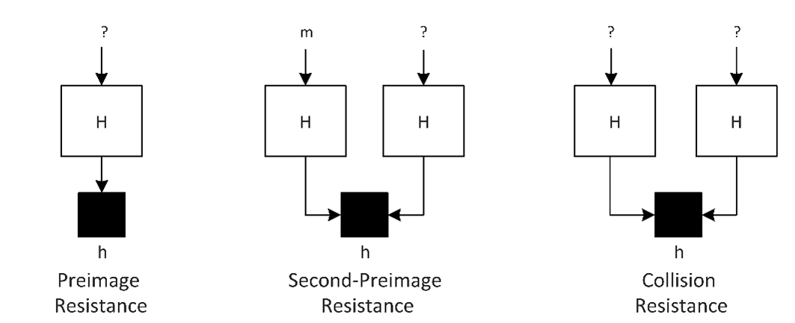
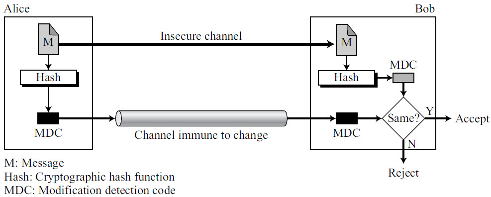
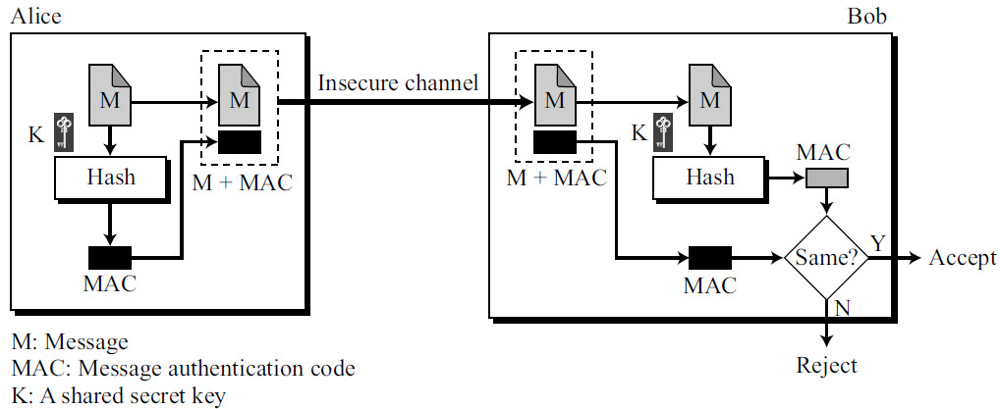

# Cryptographic Hash Functions

The [previous document](01_hash_functions.md) introduced hash functions as tools for fast lookups and even distribution. Those generic hash functions are designed to be fast and well-distributed — but not secure. An attacker who can study the algorithm can craft inputs that cause deliberate collisions, or even work backward from a hash to guess the original input.

Cryptographic hash functions add **security guarantees** on top of the same basic idea (fixed-size output from variable-size input). They are designed so that even an attacker with full knowledge of the algorithm cannot reverse, forge, or manipulate the hash output in any useful way.

## Security Properties

A cryptographic hash function must satisfy three core properties:

- **Pre-image Resistance**

    Given a hash output `h`, it should be computationally infeasible to find any input `M` such that `H(M) = h`.

    In other words, you cannot reverse the hash to recover the original data. This is essential for password storage — even if an attacker steals a database of hashed passwords, they cannot work backward to find the actual passwords.

- **Second Pre-image Resistance**

    Given an input `M1` and its hash `H(M1)`, it should be infeasible to find a different input `M2` such that `H(M1) = H(M2)`.

    This ensures integrity: an attacker who knows a valid message and its hash cannot substitute a different message that produces the same hash.

- **Collision Resistance**

    It should be infeasible to find *any* two distinct inputs `M1` and `M2` that hash to the same output. (For background on what a collision is and why collisions are inevitable, see [Hash Collision](01_hash_functions.md#hash-collision).)

    This is a stronger requirement than second pre-image resistance — the attacker is free to choose *both* inputs, not just one. Without this property, digital signatures, certificates, and blockchain systems could be forged.

Cryptographic hash functions are divided into two categories based on whether they require a secret key:

- **Unkeyed** hashes (which verify integrity)
- **Keyed** hashes (which also verify authenticity)

## Unkeyed Cryptographic Hash Functions (MDCs)

An unkeyed hash takes only the message as input — no secret key is involved. Anyone who has the same hash algorithm can compute the hash of any message. This means unkeyed hashes can verify that data has not been **tampered with** (integrity), but they cannot confirm **who produced it** (authenticity). In the literature, unkeyed hashes are formally called **Modification Detection Codes (MDCs)**.

They are used in a wide range of systems:

- **Integrity verification** — The sender hashes the message and publishes the hash (the MDC) through a channel the attacker cannot modify — a signed website, a printed manual, a separate secure connection, etc. The receiver downloads the message over any channel (even an insecure one), recomputes the hash independently, and compares. If the two hashes match, the message arrived intact; if not, something changed it in transit.

    

    In the diagram, Alice sends message **M** over an insecure channel and its hash (the **MDC**) over a channel immune to change. Bob receives both, recomputes `Hash(M)` himself, and compares with the MDC he received. A match means the message was not altered; a mismatch means it was.

    Real-world examples of this pattern: software packages and container images publish SHA-256 digests on an HTTPS download page; firmware updates ship with a hash that the device verifies before flashing; Git stores a SHA-1 (migrating to SHA-256) hash of every commit so that any tampering in the repository history is detected automatically.

- **Digital signatures** — Signing algorithms (like RSA or ECDSA) do not sign the raw message. Instead, they sign its hash digest, which is smaller and faster to process. The hash ensures that any change to the message — no matter how small — invalidates the signature.

- **Password storage** — Storing passwords in plain text is dangerous. Instead, systems store the hash of the password. When a user logs in, the system hashes the submitted password and compares it to the stored hash. Note: general-purpose hashes like SHA-256 are too fast for this purpose — attackers can try billions of guesses per second. In practice, specialized password hashing functions like **Argon2**, **bcrypt**, or **scrypt** are used. These are deliberately slow and memory-intensive to make brute-force attacks impractical.

- **Blockchain and Merkle trees** — Cryptocurrencies and distributed ledgers use hashes like SHA-256 for block linking and transaction verification. Each block contains the hash of the previous block, forming a tamper-evident chain.

| **Hash Function**               | **Year** | **Designer / Origin**          | **Bit Length** | **Key Properties / Use Cases**                                           |
| ------------------------------- | -------- | ------------------------------ | -------------- | ------------------------------------------------------------------------ |
| **MD4**                         | 1990     | Ronald Rivest                  | 128-bit        | Historical; basis for MD5 and NTLM; insecure today.                      |
| **MD5**                         | 1992     | Ronald Rivest                  | 128-bit        | Very fast but broken (collisions); safe only for non-security checksums. |
| **SHA-1**                       | 1995     | NSA                            | 160-bit        | Deprecated; collision attacks demonstrated.                              |
| **RIPEMD-160**                  | 1996     | Dobbertin, Bosselaers, Preneel | 160-bit        | Secure alternative to SHA-1; used in Bitcoin address derivation.         |
| **SHA-2 (SHA-224/256/384/512)** | 2001     | NSA                            | 224–512-bit    | Mainstream secure hash family; used in TLS, certificates, etc.           |
| **Whirlpool**                   | 2003     | Rijmen & Barreto               | 512-bit        | AES-based; ISO/IEC standard; used in some backup tools.                  |
| **Skein**                       | 2010     | Schneier et al.                | Variable       | SHA-3 finalist; flexible and high-performance design.                    |
| **BLAKE / BLAKE2**              | 2010 / 2013 | Aumasson et al.             | 256 / 512-bit  | Very fast and secure; BLAKE2 adopted in libsodium and Argon2.            |
| **SHA-3 (Keccak)**              | 2015     | Bertoni et al.                 | Variable       | Sponge construction; immune to length-extension; FIPS 202 standard.      |
| **BLAKE3**                      | 2020     | O'Connor et al.                | 256-bit        | Modern, parallelizable, SIMD-optimized successor to BLAKE2.              |

## Keyed Cryptographic Hash Functions (MACs)

Unkeyed hashes have a limitation: since anyone can compute the hash, an attacker who intercepts a message can modify it, recompute the hash, and send both — the receiver has no way to detect the tampering.

A **Message Authentication Code (MAC)** solves this by incorporating a **secret key** into the hash computation. Only someone who possesses the key can produce (or verify) a valid MAC. This guarantees both **integrity** (the message was not altered) and **authenticity** (the message came from someone who knows the key).

Here is how it works:

1. The sender and receiver share a secret key ahead of time.
2. The sender computes `MAC = H(key, message)` and sends both the message and the MAC.
3. The receiver computes the MAC independently using the same key and message. If it matches, the message is authentic and unmodified.

Without the secret key, an attacker cannot forge a valid MAC — even if they modify the message, they cannot produce the correct MAC for it.

Keyed hashes are vital for message authentication in secure communication protocols such as TLS, SSH, IPSec, and JWT.

| **Algorithm**           | **Year** | **Designer / Origin**                     | **Underlying Hash / Primitive**        | **Key Properties / Use Cases**                                                        |
| ----------------------- | -------- | ----------------------------------------- | -------------------------------------- | ------------------------------------------------------------------------------------- |
| **HMAC**                | 1996     | Mihir Bellare, Ran Canetti, Hugo Krawczyk | Any hash (e.g., SHA-2, SHA-3, BLAKE2) | Combines a secret key with a hash; standard MAC in TLS, SSH, JWT, APIs.               |
| **Poly1305**            | 2005     | Daniel J. Bernstein                       | Polynomial over GF(2¹³⁰–5)            | MAC used in AEAD modes like ChaCha20-Poly1305; extremely fast and secure.             |
| **VMAC / UMAC**         | 2006 / 2007 | Ted Krovetz et al.                     | Universal hash families               | High-speed MACs leveraging AES or NH for vectorized environments.                     |
| **SipHash**             | 2012     | Aumasson & Bernstein                      | Custom ARX function                   | Fast, 64-bit keyed hash to prevent hash-table DoS attacks (used in Python, Go, Ruby). |
| **BLAKE2b/s with Key**  | 2013     | Aumasson et al.                           | BLAKE2                                | Native keyed mode; simpler alternative to HMAC for authentication.                    |
| **KMAC**                | 2016     | NIST (FIPS 202 extension)                 | SHA-3 / Keccak                        | Official keyed variant of SHA-3; supports customization and variable output.          |
