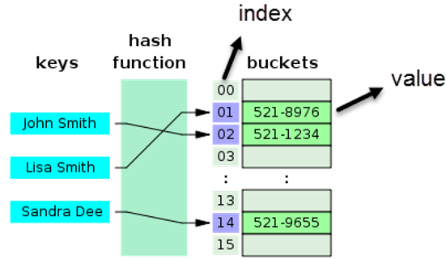
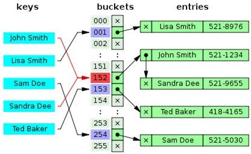
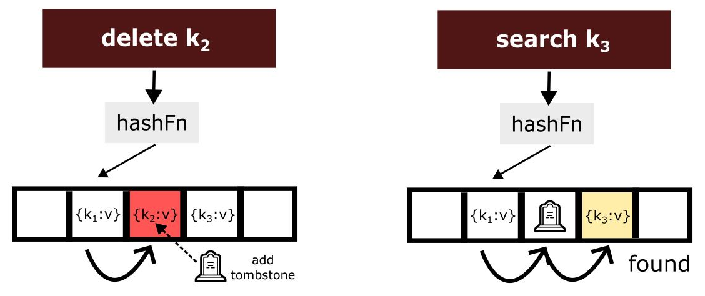
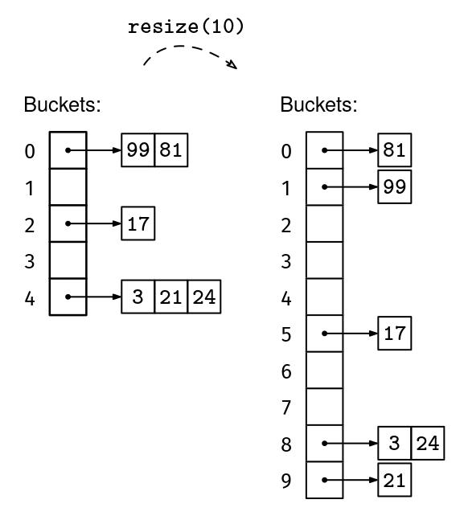

# Hash Table

A hash table stores **key-value pairs** and lets you look up any value by its key in near-constant time. Think of it like a phone book — you have a list of contacts and you want to find any person's number instantly, without scanning the entire list.

Suppose we have these contacts:

| Key (Name) | Value (Phone) |
|------------|---------------|
| John Smith | 521-1234      |
| Lisa Smith | 521-8976      |
| Sandra Dee | 521-9655      |

Without a hash table, finding Sandra Dee's number means scanning every entry until you find her — slow for large lists. A hash table solves this by using a **hash function** to compute an **index** (also called a **bucket**) for each key. The value is then stored directly at that index in an array:

1. Feed the key into the hash function: `hash("John Smith") → 02`
2. Store the value `521-1234` at bucket `02`
3. Repeat for every entry

Now, to look up John Smith's number later, just hash the key again — you get `02`, jump straight to that bucket, and read the value. No scanning required.

Keys can be integers, strings, or any hashable object, while values can be anything.

## Which Hash Functions Do Hash Tables Use?

Hash tables use **generic (non-cryptographic) hash functions** — the kind covered in [Hash Functions](01_hash_functions.md). The only requirements are speed and uniform distribution. Cryptographic properties like collision resistance and one-wayness are unnecessary and would only add overhead.

| Hash type | Used in hash tables? | Why / why not |
|-----------|:-------------------:|---------------|
| **Generic** (MurmurHash, xxHash, FNV-1a) | ✓ | Fast + good distribution — exactly what a hash table needs |
| **Keyed** (SipHash) | ✓ | When input is untrusted — prevents HashDoS attacks. Used by Python, Rust, Ruby |
| **Cryptographic** (SHA-256, BLAKE2) | ✗ | 10–100× slower for no benefit. Hash tables don't need collision resistance or one-wayness |

The one exception is **SipHash**, which sits between generic and cryptographic. It requires a secret key, making it impossible for an attacker to craft inputs that all collide. This matters for hash tables in web servers and language runtimes that accept untrusted input (URLs, headers, form fields). Without a keyed hash, an attacker could send thousands of carefully chosen keys that all land in the same bucket, turning O(1) lookups into O(n) — a denial-of-service attack called **HashDoS**.

For more on cryptographic and keyed hash functions, see [Cryptographic Hash Functions](02_hash_cryptographic.md).

## Operations

A hash table supports three core operations:

- **Lookup** — Find the bucket using `hash(key)`, then check if the key exists there. If it does, return its value. If not, report that the key is not in the table.

- **Insert** — Find the bucket using `hash(key)`. If the key already exists, update its value. If it does not, store the new key-value pair at that bucket.

- **Delete** — Find the bucket using `hash(key)`, locate the key, and remove it.

> In every case, the first step is the same: hash the key to find which bucket it belongs to.

With a good hash function and a reasonable load factor, collisions are infrequent and each operation touches only a small number of slots. This is why hash tables achieve **O(1)** average time — far faster than scanning a list (**O(n)**) or searching a balanced tree (**O(log n)**). When collisions do occur, the exact steps depend on the collision resolution strategy (covered below).

## Load Factor

Before discussing how hash tables handle collisions, it helps to understand the **load factor** — a metric that appears throughout the analysis of hash table performance.

The load factor measures how full a hash table is:

    load factor (α, "alpha") = number of stored elements / number of available buckets

For example, if a hash table has 16 buckets and 12 entries are stored, the load factor is `12 / 16 = 0.75`.

- A **low** load factor means most buckets are empty → fewer collisions, faster lookups.
- A **high** load factor means the table is crowded → more collisions, slower lookups.

The exact limits of the load factor depend on the collision resolution strategy, which is covered in the sections below.

## Collision Resolution

A collision occurs when two or more different keys map to the same bucket. This is inevitable whenever the number of possible keys exceeds the number of available slots (see the Pigeonhole Principle in [Hash Functions](01_hash_functions.md#hash-collision)).

A good hash table design relies not only on a well-distributed hash function but also on an effective strategy for **resolving collisions**.

Collision resolution techniques fall into two families:

| Family             | Also Known As   | Where Collisions Are Stored |
|--------------------|-----------------|---|
| **Open hashing**   | Chaining        | In an external structure (linked list or dynamic array) attached to the bucket |
| **Closed hashing** | Open addressing | In alternative slots within the table itself |

The naming can be confusing:

**"Open" hashing (chaining)** — each bucket is "open" to hold multiple entries via an external chain.

**"Closed" hashing (open addressing)** — each slot is "closed" to holding more than one entry, so collisions are resolved by probing for an "open" (empty) address elsewhere in the table.

### Open Hashing (Chaining)

In chaining, each bucket points to a linked list (or dynamic array) that holds all entries whose keys hash to that index.

The diagram below shows five contacts stored in a hash table with 256 buckets. Most keys land in their own bucket — Sandra Dee in 153, Ted Baker in 254, Sam Doe in 255. But `"John Smith"` and `"Lisa Smith"` both hash to bucket **152** (a collision). Instead of overwriting one with the other, chaining links them together: bucket 152 points to Lisa Smith, which points to John Smith.

To look up John Smith, the hash function sends us straight to bucket 152. We then walk the short chain — check Lisa Smith (no match), then John Smith (match) — and return `521-1234`. The chain is typically only one or two entries long, so this is still very fast.

Because chains can grow as long as needed, the load factor can exceed 1 (more entries than buckets). This approach is simple and flexible, but requires extra memory for the linked list pointers.

#### Operations with Chaining

All three operations start by hashing the key to find the bucket, then work within that bucket's chain:

- **Lookup** — Walk the chain and compare each entry's key. Average time is **O(1 + α)** — one hash computation plus a short chain traversal. In the worst case (all `n` keys in one bucket), it degrades to **O(n)**.

- **Insert** — Walk the chain to check if the key already exists. If it does, update its value. Otherwise, prepend the new entry to the front of the chain. The traversal dominates, so average time is **O(1 + α)**, matching lookup. Worst case is **O(n)**.

- **Delete** — Find the key in the chain and remove it. Average time is **O(1 + α)**, since finding the key requires traversing part of the chain. Worst case is **O(n)** when all keys collide into one bucket. With a doubly linked list, unlinking the node is O(1) once it is found because there is no need to traverse back to the previous node.

#### Implementation

- [Chaining with a Dynamic Array](../hash_table/chaining_dynamic_array.py)

- [Chaining with a Singly Linked List](../hash_table/chaining_singly_linked_list.py)

### Closed Hashing (Open Addressing)

In open addressing, all keys are stored **directly in the hash table's slots**. No external structures (like linked lists) are used. When a collision occurs, the algorithm probes for another slot according to a **probing sequence** until an empty slot is found.

Because each slot holds at most one entry, the load factor can never exceed 1. Performance deteriorates rapidly as `α` approaches 1, since nearly every insertion or lookup triggers a long probe sequence.

#### Probing Strategies

- **Linear Probing**

    Check the next slot sequentially, wrapping around if needed.

    Probe sequence: `h(k)`, `h(k) + 1`, `h(k) + 2`, `h(k) + 3`, …

    Linear probing suffers from **primary clustering**: consecutive occupied slots form long runs, and any new key that hashes into the cluster extends it further, making future collisions more likely.

- **Quadratic Probing**

    Probe using quadratic offsets to spread out the probing.

    Probe sequence: `h(k)`, `h(k) + 1²`, `h(k) + 2²`, `h(k) + 3²`, …

    Quadratic probing avoids primary clustering because probes are spread across wider gaps. However, it can still suffer from **secondary clustering**, where keys with the same initial hash follow the same probe sequence. It also requires care to avoid infinite loops (the table size should be prime or a power of two with specific step patterns).

- **Double Hashing**

    Use a second hash function to compute the step size.

    Probe sequence: `h(k)`, `h(k) + f(k)`, `h(k) + 2·f(k)`, …

    Double hashing minimizes both primary and secondary clustering because the step size depends on a second, independent hash function. This typically provides the best distribution among the three strategies.

#### Slot States

In open addressing, each slot must track one of three states:

| State | Meaning | Behavior |
|---|---|---|
| **EMPTY** | Slot has never been occupied | Lookup stops here — the key is not in the table |
| **OCCUPIED** | Slot currently holds a key-value pair | Lookup continues if the key does not match |
| **DELETED** (Tombstone) | Slot previously held a key that was removed | Lookup must continue past this slot; insert may reuse it |

**Why is the DELETED state necessary?**

In open addressing, a lookup follows the probe sequence until it finds the key or reaches an EMPTY slot (which proves the key is not in the table). If a deleted key's slot were simply marked EMPTY, any key that was inserted *after* the deleted key — and whose probe sequence passed through that slot — would become unreachable. The lookup would stop at the now-EMPTY slot before ever reaching the key that is still stored further along the sequence.

A DELETED (tombstone) marker tells the lookup: *"this slot is vacant, but the probe sequence continues."* During insertion, tombstones are treated as available slots so the space can be reused.

The diagram below shows this in action. On the left, `k₂` is deleted and its slot is replaced with a tombstone. On the right, a search for `k₃` probes through `k₁` (no match), skips the tombstone, and reaches `k₃` — which would have been unreachable if the slot had been marked EMPTY instead.

#### Operations with Open Addressing

All three operations start by hashing the key, then follow the **probe sequence** from that starting slot:

- **Lookup** — Follow the probe sequence. Stop when the key is found (return its value) or an EMPTY slot is reached (the key is not in the table). Skip over DELETED slots.

- **Insert** — Follow the probe sequence. If the key already exists, update its value. Otherwise, place the entry in the first EMPTY or DELETED slot encountered. Prefer reusing a tombstone to keep probe sequences short.

- **Delete** — Find the key via the probe sequence. If found, mark the slot as DELETED rather than EMPTY. This preserves the integrity of probe sequences for other keys.

#### Implementation

- [Open Addressing with Linear Probing](../hash_table/open_addressing_linear_probing.py)

#### Advantages and Limitations

**Advantages**

- No pointer overhead — all data is stored in a compact array.
- Cache-friendly — scanning contiguous array slots is fast on modern CPUs.
- For the same memory budget, more slots can be allocated, potentially reducing collisions.

**Limitations**

- Suffers from clustering, especially with linear probing.
- Performance degrades significantly as the load factor approaches 1.
- Requires tombstones for deletion, which add complexity and can degrade performance if too many accumulate.

## Performance Summary

| Operation | Chaining (average) | Chaining (worst) | Open Addressing (average) | Open Addressing (worst) |
|-----------|--------------------|------------------|---------------------------|-------------------------|
| Lookup    | O(1 + α)           | O(n)             | O(1 / (1 − α))            | O(n) |
| Insert    | O(1 + α)           | O(n)             | O(1 / (1 − α))            | O(n) |
| Delete    | O(1 + α)           | O(n)             | O(1 / (1 − α))            | O(n) |

*α = load factor, n = number of stored elements.*

The main advantage of hash tables over other data structures — such as balanced search trees or sorted arrays — is **speed**. This advantage becomes more pronounced as the number of elements grows. For this reason, hash tables are widely used for associative arrays (maps, dictionaries), sets, database indexing, and caches.

## Resizing

As a hash table fills up, its load factor increases and performance degrades. **Resizing** creates a new, larger array of buckets and rehashes all existing keys into it.

Since the index is computed as `hash(key) % number_of_buckets`, changing the bucket count changes the index for most keys. This makes resizing computationally expensive — every stored element must be reinserted. Implementations therefore resize infrequently, typically by doubling the bucket count when a threshold is exceeded.

- **Chaining** — Resizing is not strictly required since chains can grow indefinitely. However, it is still done in practice once the load factor gets too high (e.g., > 1), because long chains reduce lookup efficiency.

- **Open addressing** — Resizing is mandatory when the load factor nears a threshold (typically 0.66–0.75). Beyond that point, probe sequences become excessively long and performance collapses.

The diagram below illustrates resizing a chained hash table. The table holds 6 entries and grows from 5 to 10 buckets, so the load factor drops from `6/5 = 1.2` to `6/10 = 0.6`. Every entry is rehashed with the new bucket count, so most keys land in different buckets. The result: the longest chain shrinks from 3 entries to 2, and lookups become faster.

For a visual walkthrough of hash table resizing, see this [video explanation](https://www.youtube.com/watch?v=h2d9b_nEzoA).

## Hash Table in Python

In Python, hash tables are the underlying implementation of **dictionaries** (`dict`). Here is how Python's design maps to the concepts above:

- **Hashing** — Objects that implement `__hash__` are hashable. Built-in types like integers, strings, floats, and tuples are inherently hashable.

- **Hash functions** — Integers usually hash to themselves (with special handling, e.g., `hash(-1) == -2`). Strings use **SipHash13**, a keyed hash designed to resist collision attacks (see [Cryptographic Hash Functions](02_hash_cryptographic.md#keyed-cryptographic-hash-functions-macs)). Older Python versions (before 3.11) used SipHash24.

- **Indexing** — `index = hash(key) % number_of_buckets`.

- **Collision handling** — Python uses **open addressing** with a custom **perturbation-based probing** scheme. On each collision, the next index is computed as `j = (5*j) + 1 + perturb`, where `perturb` starts at the full hash value and is right-shifted by 5 bits after each step. This makes the probe sequence depend on every bit of the hash code, providing better distribution than simple linear or quadratic probing.

- **Resizing** — When the load factor exceeds **2/3** (~0.67), Python resizes the hash table by allocating more buckets and rehashing all keys.

This design allows Python dictionaries to provide average-case **O(1)** performance for lookups, insertions, and deletions — making `dict` one of the most efficient and versatile built-in data structures.
