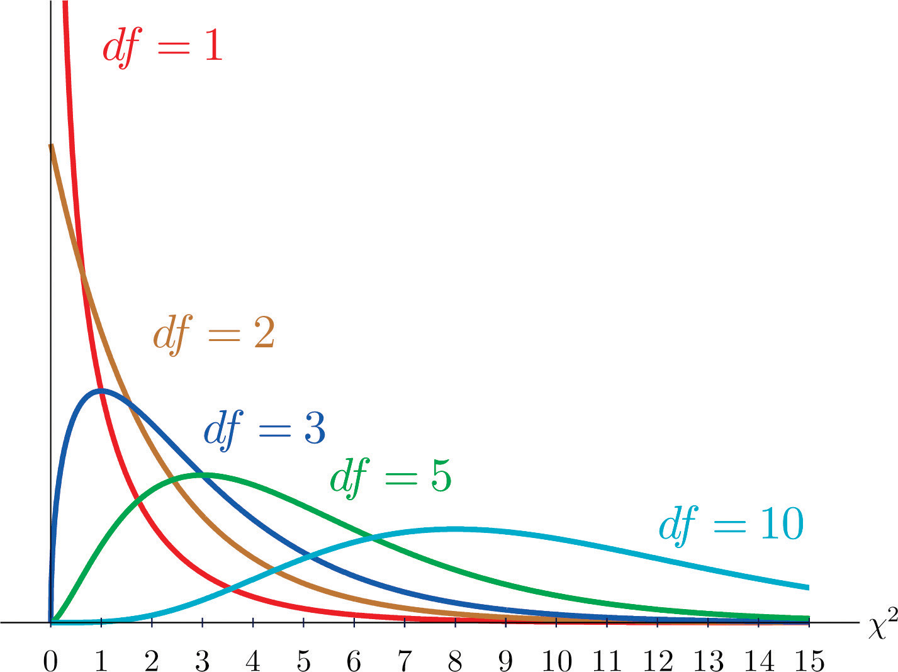

# Chi-Squared Test

The chi-squared ($\chi^2$) test answers one core question: **do the outcomes look like what a fair random process would produce?**

## The Problem

Imagine you roll a die 60 times. If the die is completely fair, each face should appear about 10 times. Here are your hypothetical results:

| Face | Expected | Observed |
|:----:|:--------:|:--------:|
| 1    | 10       | 8        |
| 2    | 10       | 12       |
| 3    | 10       | 11       |
| 4    | 10       | 7        |
| 5    | 10       | 13       |
| 6    | 10       | 9        |

None of the counts are exactly 10 — but they are all reasonably close. Is this normal random variation, or is the die loaded? You need a way to measure "how far off" these results are and whether that amount of deviation is expected. That is precisely what the chi-squared test does.

## The Formula

The idea is straightforward: for each category (face of the die), measure how far the observed count is from the expected count. Square that difference — this makes all deviations positive and penalizes large deviations more heavily than small ones. Then divide by the expected count to normalize — a deviation of 3 matters more when you expected 5 than when you expected 500. Finally, add up all the terms:

$$ \chi^2 = \sum_{i=1}^{k} \frac{(O_i - E)^2}{E} $$

- $k$ = number of categories (6 faces for a die)
- $O_i$ = observed count for category $i$
- $E$ = expected count per category ($N / k$, where $N$ is the total number of trials)

### Step-by-Step Example

Applying the formula to the die rolls above ($E = 10$ for each face):

| Face | $O_i - E$ | $(O_i - E)^2$ | $(O_i - E)^2 / E$ |
|:----:|:---------:|:--------------:|:------------------:|
| 1    | −2        | 4              | 0.4                |
| 2    | +2        | 4              | 0.4                |
| 3    | +1        | 1              | 0.1                |
| 4    | −3        | 9              | 0.9                |
| 5    | +3        | 9              | 0.9                |
| 6    | −1        | 1              | 0.1                |
| **Total** |      |                | **$\chi^2$ = 2.8** |

The resulting chi-squared statistic is **2.8**. But is 2.8 good or bad? To answer that, you need a baseline — and that requires understanding degrees of freedom.

## Degrees of Freedom

The expected value of $\chi^2$ depends on how many categories you are testing. This is expressed through the **degrees of freedom (df)**:

$$ df = k - 1 $$

For a standard die: $df = 6 - 1 =$ **5**.

> **Why $k - 1$ and not $k$?**
> Because the counts are not fully independent — they must add up to $N$ (the total number of rolls). Once you know the exact counts for 5 faces, the 6th is mathematically determined. So there are only $k - 1$ independent values.

Mathematically, the expected (average) $\chi^2$ score for a perfectly fair random process equals its degrees of freedom. For our die, the expected $\chi^2$ is **5**. Our result of 2.8 is well within the range of normal random variation around that expected value.

## The Chi-Squared Distribution

We computed a single $\chi^2$ value of 2.8 from one experiment (60 rolls). But a single number on its own is not very useful — we need to know where 2.8 falls in the range of values that a fair die *typically* produces.

Imagine repeating the experiment many times — roll the same fair die 60 times, compute $\chi^2$, and record it. Each repetition gives a different $\chi^2$ because randomness produces different counts each time:

| Experiment | Face counts | $\chi^2$ |
|:--:|:--|--:|
| 1 | 8, 12, 11, 7, 13, 9 | 2.8 |
| 2 | 9, 11, 10, 12, 8, 10 | 1.4 |
| 3 | 6, 14, 9, 11, 10, 10 | 4.0 |
| 4 | 10, 7, 15, 8, 12, 8 | 5.4 |
| … | … | … |
| 10,000 | 11, 9, 10, 13, 8, 9 | 2.4 |

If you plot a histogram of those 10,000 $\chi^2$ values, you get a characteristic shape — this is the **chi-squared distribution** for $df = 5$. The curve is right-skewed: most values cluster around 3–7 (near the expected value of 5), with a long tail stretching toward larger values. This shape tells you at a glance where a fair result typically lands and where it becomes suspicious.

The shape depends only on the degrees of freedom, not on what the experiment is — dice, hash buckets, or coin flips all produce the same curve for the same $df$. The diagram below shows the chi-squared distribution for several values of $df$. The vertical axis is **probability density** — a measure of how frequently values occur in a given region (higher means more common).



Notice how the curves shift rightward as $df$ increases: $df = 3$ peaks around 1, $df = 5$ around 3, and $df = 10$ around 8. Each peak (called the **mode**) sits at $df - 2$, while the **mean** (center of mass) of each curve sits at exactly $df$ — which is why the bulk of each distribution is centered near its $df$ value even though the peak is offset slightly to the left.

In practice, you do not need to actually run 10,000 experiments. Mathematicians have worked out this distribution theoretically — given $df$, the exact shape of the curve is known. The repeated-experiment table above is just a way to build intuition for what the curve represents: the full range of $\chi^2$ values that a fair process with that many categories produces.

## What Does $\chi^2 = 0$ Mean?

Looking at the formula, every term $(O_i - E)^2 / E$ is a squared difference — it can never be negative. The only way the entire sum can equal zero is if *every single* $O_i = E$ — every observed count exactly matches the expected count.

For our die, $\chi^2 = 0$ would mean each face came up exactly 10 times out of 60 rolls. That sounds ideal, but look at the distribution curve for $df = 5$: the density at $\chi^2 = 0$ is essentially zero. A fair die virtually never produces a perfectly even result — there are 6 independent counts that must *all* land exactly on target simultaneously. A truly random process always produces some messy variation, so results that are *too* perfect suggest something other than randomness.

## The Two-Sided Trap

This leads to an important insight: a $\chi^2$ score can be suspicious in *two* directions. Most textbooks focus on high $\chi^2$ — outcomes are too clumped, suggesting bias. But a $\chi^2$ that is too *low* is equally problematic — outcomes are too uniform to be genuinely random, suggesting human tampering, fabricated data, or a mechanical process that is not actually random.

This is the **two-sided trap**: a distribution can fail by being too clumped (high $\chi^2$) *or* too uniform (low $\chi^2$). A good test must flag deviations in **both** directions.

## P-Values

A $\chi^2$ value on its own does not tell you much — its meaning depends entirely on the degrees of freedom. A $\chi^2$ of 105 is catastrophic when $df = 5$ (where the expected value is 5) but perfectly normal when $df = 99$ (where the expected value is 99). The raw score alone does not provide enough context. The **P-value** solves this by combining $\chi^2$ and $df$ into a single probability:

> **If this process is completely fair, what is the probability of seeing a $\chi^2$ score this large (or larger) just by pure chance?**

Visually, the P-value is the **area under the chi-squared distribution curve to the right of your observed $\chi^2$**:

1. Plot the chi-squared distribution curve for your $df$.
2. Mark your observed $\chi^2$ on the horizontal axis.
3. The shaded area from that point to the right is the P-value — the probability of seeing a result at least this extreme by chance.

A small area (small P-value) means your result is out in the far tail where fair processes rarely land. A large area (large P-value) means your result sits in the middle of the curve where fair processes land all the time.

- **High P-value (e.g., 0.50):** Very normal. You would see results like this half the time with a fair die.
- **Low P-value (e.g., 0.01):** Highly unusual. A fair die would almost never produce this result, suggesting the die is likely biased.

In standard statistical practice, a P-value below **0.05** is the conventional threshold for declaring a result "statistically significant" — there is less than a 5% chance these outcomes arose from a fair random process, leading us to conclude the process is likely biased.

### Computing P-Values

In practice, nobody computes P-values by hand. You either look them up in a [chi-squared table](https://en.wikipedia.org/wiki/Chi-squared_distribution#Table_of_%CF%872_values_vs_p-values) or use software. In Python:

```python
from scipy.stats import chi2

p_value = chi2.sf(2.8, df=5)   # sf = "survival function" = 1 − CDF
print(p_value)                  # 0.7308 → 73%
```

`chi2.sf(x, df)` returns the probability of seeing a $\chi^2$ value ≥ `x` under a fair process with `df` degrees of freedom — that is exactly the P-value. The survival function is the complement of the **CDF (cumulative distribution function)**, which gives the probability of a value ≤ `x`. Since we want the probability of a value *at least* as large as `x`, we use `sf = 1 − CDF`.

## The |z| Score

The P-value works well when testing a single die, but becomes awkward when comparing many experiments at once. If you have a table with hundreds of cells, reading P-values (0.73, 0.0001, 0.99, …) and mentally deciding which are good is tedious. The **|z| score** solves this by converting the $\chi^2$ into the number of standard deviations away from the expected value.

First, compute the raw $z$ score:

$$ z = \frac{\chi^2 - df}{\sqrt{2 \cdot df}} $$

The numerator measures how far the result is from the ideal ($\chi^2 = df$). The denominator $\sqrt{2 \cdot df}$ is the standard deviation of the chi-squared distribution with $df$ degrees of freedom. Dividing by it converts the raw deviation into "number of standard deviations from expected." A positive $z$ means the distribution is more clumped than expected; a negative $z$ means it is more uniform than expected.

> **Note:** The $z$ score follows an approximately standard normal distribution, and this approximation improves as $df$ grows. For large $df$ (such as 99 buckets in hash table tests), it is very accurate.

Taking the absolute value gives **|z|**, which captures deviations in *both* directions — too high (clumped) and too low (suspiciously uniform). This directly addresses the two-sided trap described above:

- **|z| ≤ 2** — the distribution is consistent with uniformity. Normal random variation.
- **2 < |z| ≤ 3** — borderline. Worth investigating but not definitive on its own.
- **|z| > 3** — the distribution is significantly non-uniform. A clear failure, in either direction.

### Why |z| Instead of P-Values?

|z| is easier to read at a glance: anything above 3 is a failure, everything at or below 2 is fine, and the range in between warrants a closer look. It also naturally captures the two-sided concern — a |z| of 7 from a $\chi^2$ that is too *low* is just as bad as a |z| of 7 from a $\chi^2$ that is too *high*. P-values do not express this symmetry without additional interpretation.

### Worked Example

Suppose you test three different dice — roll each one 60 times and record the face counts. With 6 faces, $df = 6 - 1 = 5$, so the expected $\chi^2$ is 5 and the standard deviation is $\sqrt{2 \cdot 5} = \sqrt{10} \approx 3.16$. For each die, compute $\chi^2$, look up its P-value, and convert to |z|:

| Die   | Face counts            | $\chi^2$ | P-value | $z = (\chi^2 - 5) / 3.16$  | \|z\| | Verdict |
|:-----:|:-----------------------|:--------:|:-------:|:--------------------------:|:-----:|:--------|
| **A** | 8, 12, 11, 7, 13, 9    | 2.8      | 0.73    | $(2.8 - 5) / 3.16 = -0.7$  | 0.7   | ✓ Normal variation |
| **B** | 2, 3, 1, 4, 45, 5      | 148.0    | < 0.001 | $(148 - 5) / 3.16 = 45.2$  | 45.2  | ✗ Extreme clumping |
| **C** | 10, 10, 10, 10, 10, 10 | 0.0      | 1.00    | $(0 - 5) / 3.16 = -1.6$    | 1.6   | ⚠ Two-sided trap |

Die C deserves a closer look. Its $\chi^2$ is 0, which produces |z| = 1.6 — below the threshold of 2, so |z| alone says "looks fine." But think about what $\chi^2 = 0$ actually means: every single face came up *exactly* 10 times out of 60 rolls. A truly random die virtually never does that — there are 6 counts that must all land perfectly on target simultaneously. The result is *too* perfect to be believable.

The reason |z| does not flag it here is that $df = 5$ is small. With a larger experiment — say 10,000 rolls into 100 buckets ($df = 99$) — a $\chi^2$ of exactly 0 would give |z| = $99 / \sqrt{198} \approx 7.0$, a clear failure. As the experiment grows, |z| catches this anomaly unambiguously. At small $df$, it remains a useful shortcut but not a replacement for judgment.

## Application to Hash Functions

Everything above applies directly to hash functions — just replace "die faces" with "buckets":

| Dice experiment | Hash function test |
|:--|:--|
| Roll a die 60 times | Hash 10,000 keys into 100 buckets |
| 6 faces | 100 buckets |
| "Is this die fair?" | "Does this hash spread keys evenly?" |
| Expected: each face ≈ 10 | Expected: each bucket ≈ 100 |
| df = 5 | df = 99 |

To test a hash function, we hash many keys and use `hash(key) % number_of_buckets` to assign each one to a bucket — this is exactly what a hash table does internally, which is why the test directly measures real-world quality. A good hash function acts like a fair die — each bucket receives roughly the same number of keys, with natural random variation. A bad hash function acts like a loaded die — some buckets overflow while others sit empty.

There is one important difference between dice and hash functions. A die is genuinely random — roll it 60 times and you get different outcomes each time. A hash function is **deterministic** — `hash("hello")` always returns the same value. If you hash the same 10,000 keys again, every key lands in the same bucket as before. Nothing changes.

So what plays the role of "rolling the die"? **The keys themselves.** Each key you hash is one "roll." The experiment is: take a set of 10,000 keys, hash each one into a bucket, and count how many keys land in each bucket. You run this once — there is no need to repeat it, because the result is always the same for the same keys. What you *can* vary is the **choice of keys**: random strings, sequential integers, similar names, and so on. Different key sets test different aspects of the hash function's quality, just as rolling a die under different conditions might reveal that it is loaded.

### The Two-Sided Trap in Practice

For hash functions, a suspiciously low $\chi^2$ usually means the hash is *counting* rather than *mixing*. For example, a hash function like `h × 31 + byte` applied to sequential integer keys maps consecutive inputs onto consecutive buckets, producing an almost perfectly even distribution — not because it is a good hash, but because it is acting like a counter. The keys cycle through buckets in order rather than scattering randomly.
